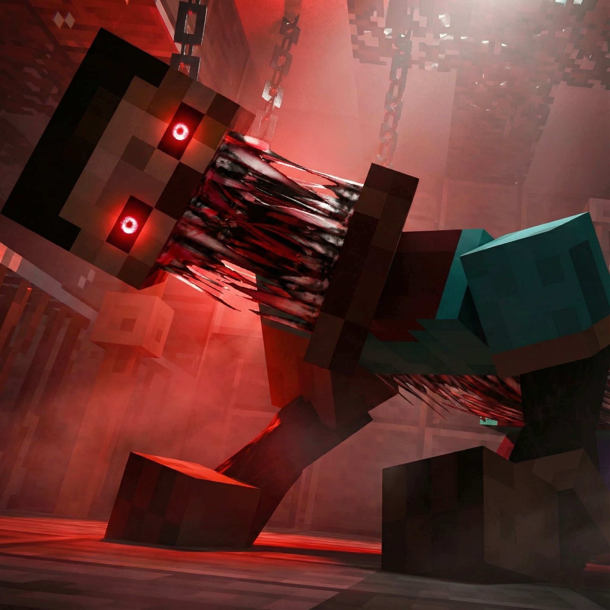

<div align="center">



# Still Watching

### Cinematic Minecraft horror-survival for Forge `1.20.1`.

[](#project-at-a-glance)
[](#project-at-a-glance)
[](https://www.curseforge.com/minecraft/modpacks/still-watching/files)
[](https://www.curseforge.com/minecraft/modpacks/still-watching)
[](./LICENSE)

**Fog hides movement. Sound becomes evidence. Darkness stops being empty.**

[Install](https://www.curseforge.com/minecraft/modpacks/still-watching) ·
[Files](https://www.curseforge.com/minecraft/modpacks/still-watching/files) ·
[Installation Guide](./installation-guide.md) ·
[Mod List](./latest-modlist.html) ·
[Gallery](https://www.curseforge.com/minecraft/modpacks/still-watching/gallery) ·
[Report Issue](../../issues)

</div>

---

> [!IMPORTANT]
> **Install Still Watching from CurseForge.**
>
> The GitHub ZIP is **not** the playable modpack installer. This repository exists for documentation, issue tracking, source-side files, and licensing clarity. If GitHub and CurseForge disagree, trust the CurseForge release and report the mismatch.

---

## Contents

- [What Is Still Watching?](#what-is-still-watching)
- [Project at a Glance](#project-at-a-glance)
- [Start Here](#start-here)
- [Why It Hits Different](#why-it-hits-different)
- [Core Horror Loop](#core-horror-loop)
- [Featured Threats](#featured-threats)
- [Screenshots](#screenshots)
- [Install](#install)
- [Recommended Setup](#recommended-setup)
- [Multiplayer & Servers](#multiplayer--servers)
- [Troubleshooting](#troubleshooting)
- [Repository Map](#repository-map)
- [Mod List](#mod-list)
- [Issue Reports](#issue-reports)
- [Contributing](#contributing)
- [Credits & License](#credits--license)
- [Final Warning](#final-warning)

---

## What Is Still Watching?

**Still Watching** is a **Minecraft horror-survival modpack** by **Soumyajit**, built for **Forge `1.20.1`**. It keeps Minecraft recognizable, then poisons the comfort: fog turns distance into doubt, caves stop feeling routine, forests feel occupied, and every sound asks for attention.

This is not a kitchen-sink pack wearing a plastic mask. Still Watching is built around pressure, pursuit, hostile exploration, and the ugly moment where you realize your base is not as safe as you thought.

Build carefully. Explore slowly. Listen before you move.

---

## Project at a Glance

| Item | Details |
| --- | --- |
| **Name** | Still Watching |
| **Creator** | Soumyajit |
| **Type** | Minecraft horror-survival modpack |
| **Minecraft version** | `1.20.1` |
| **Loader** | `Forge` |
| **CurseForge Project ID** | `1420406` |
| **Official install source** | [CurseForge](https://www.curseforge.com/minecraft/modpacks/still-watching) |
| **Latest release** | [Check CurseForge Files](https://www.curseforge.com/minecraft/modpacks/still-watching/files) |
| **Recommended RAM** | `5 GB` minimum; `6–8 GB` preferred |
| **Java** | Java `17` if the launcher asks |
| **Multiplayer** | Supported when server and clients use matching pack versions |
| **Repository purpose** | Documentation, issue tracking, source-side files, and licensing clarity |
| **Repository license** | [Apache License 2.0](./LICENSE) for original repository files only |

---

## Start Here

| Need | Link |
| --- | --- |
| **Install the pack** | [Still Watching on CurseForge](https://www.curseforge.com/minecraft/modpacks/still-watching) |
| **Download a specific release** | [CurseForge Files](https://www.curseforge.com/minecraft/modpacks/still-watching/files) |
| **Read setup notes** | [`installation-guide.md`](./installation-guide.md) |
| **Set up multiplayer/server play** | [`installation-guide.md`](./installation-guide.md#multiplayer--server-notes) |
| **Check the mod list** | [`latest-modlist.html`](./latest-modlist.html) |
| **View screenshots** | [CurseForge Gallery](https://www.curseforge.com/minecraft/modpacks/still-watching/gallery) or [`Screenshots/`](./Screenshots) |
| **Report a bug** | [GitHub Issues](../../issues) |
| **Host a server** | [BisectHosting sponsor link](https://url-shortener.curseforge.com/AZDOs) |

---

## Why It Hits Different

| Pillar | In play |
| --- | --- |
| **Fog-first horror** | Visibility becomes a resource. Distance becomes suspicious. |
| **Sound-led survival** | Footsteps, echoes, whispers, growls, and silence all matter. |
| **Pressure over cheap noise** | Stalking, pursuit, bad timing, and uncertainty do the heavy lifting. |
| **Exploration with teeth** | Caves, roads, ruins, towns, and forests offer progress with consequences. |
| **Survival stays fragile** | Gear helps. Awareness matters more. |
| **Multiplayer paranoia** | Friends add noise, panic, bad calls, and beautiful disasters in voice chat. |

---

## Core Horror Loop

1. **Prepare before dark.** Food, light, tools, exits, and backups matter.
2. **Enter unsafe ground.** Caves, forests, ruins, roads, and structures pull you in.
3. **Read the world.** Sound, fog, movement, and silence are information.
4. **Commit fast.** Fight, hide, flee, block a route, or abandon the plan.
5. **Return changed.** Better loot. Worse nerves. One more reason to fear the next night.

---

## Featured Threats

Still Watching uses creature pressure, folklore horror, environmental dread, and corrupted Minecraft familiarity. The goal is not to invent random chaos. The goal is to make normal survival feel hunted.

| Threat / Theme | What it brings |
| --- | --- |
| **The Anomaly** | A signature presence that makes shelter and travel feel watched. |
| **The Man From The Fog** | Mist stops being scenery and starts acting like cover for something worse. |
| **Apollyon** | High-pressure danger where planning can collapse into reaction. |
| **The Mimicer** | Trust gets expensive. Familiar things stop feeling reliable. |
| **Goatman** | Forest paths, bridges, and lonely routes become bad decisions with leaves. |
| **The Midnight Lurker** | Darkness-focused pressure that punishes hesitation. |
| **Siren Head** | A towering horror presence built around distance, exposure, and awareness. |
| **Cave Dweller pressure** | Underground exploration becomes dangerous again. Strip-mining autopilot gets humbled. |
| **Herobrine-inspired horror** | Classic Minecraft myth energy: sightings, unease, and corrupted familiarity. |
| **Ambient audio and darkness** | Footsteps, echoes, visibility loss, and silence make the world participate. |

---

## Screenshots

<div align="center">

[](https://www.curseforge.com/minecraft/modpacks/still-watching/gallery)
[](./Screenshots)

</div>

---

## Install

CurseForge is the supported install path. Use it unless you have a specific reason not to.

### Recommended install

1. Install the [CurseForge App](https://www.curseforge.com/download/app).
2. Open [Still Watching on CurseForge](https://www.curseforge.com/minecraft/modpacks/still-watching).
3. Click **Install** / **Install via App**.
4. Launch the installed profile once with no extra mods.
5. Allocate at least **`5 GB` RAM** if the launcher does not already do it.
6. Use Java **`17`** if the launcher asks.
7. Confirm the game loads, audio works, and FPS is playable.
8. Put on headphones.
9. Step into the fog.

### Not the install path

Downloading this repository as a ZIP will not give you a clean playable modpack install. The GitHub ZIP is for repository files, not launcher-ready distribution. Use CurseForge for actual gameplay.

For manual imports, server setup, backups, logs, and deeper troubleshooting, read:

<div align="center">

[](./installation-guide.md)

</div>

---

## Recommended Setup

| Setting | Recommendation |
| --- | --- |
| **RAM** | `5 GB` minimum; `6–8 GB` preferred |
| **Java** | Java `17` if your launcher asks |
| **Headphones** | Strongly recommended; audio cues matter |
| **Brightness** | Keep low/default for the intended horror atmosphere |
| **Shaders** | Optional; disable or reduce settings if FPS suffers |
| **Render distance** | Start around `8–10 chunks`; lower first during FPS drops |
| **Simulation distance** | Start around `5–6 chunks` |
| **Extra mods** | Test one at a time on a clean profile |
| **Backups** | Make them before updates, server moves, or config experiments |

### First-launch baseline

Start clean before blaming the fog:

- No additional mods.
- No stacked resource packs.
- No extra shaders.
- RAM set to at least `5 GB`.
- Render distance around `8–10 chunks`.
- Simulation distance around `5–6 chunks`.

A clean baseline gives useful evidence. A chaotic baseline is just a crime scene with particles.

---

## Multiplayer & Servers

Multiplayer is supported when the server and every client use matching pack versions. Horror modpacks punish sloppy setup harder than most. Keep the install clean or enjoy debugging your own monster.

Checklist:

- Use the **same Still Watching version** on server and clients.
- Match **Minecraft `1.20.1`** and the required **Forge** version.
- Use server files/configs that match the selected CurseForge release when available.
- Keep client-only visual, shader, UI, map, and rendering/performance mods off dedicated servers when required.
- Back up the world before updates, migrations, or config experiments.
- Test world generation before inviting players.
- Test voice/audio settings before the first real session.
- Keep logs. Reports without logs are vibes, not diagnostics.

<div align="center">

<!-- sponsor:bisecthosting:start -->
<a href="https://url-shortener.curseforge.com/AZDOs" rel="nofollow">
  
</a>
<!-- sponsor:bisecthosting:end -->

</div>

Full server notes: [`installation-guide.md`](./installation-guide.md#multiplayer--server-notes)

---

## Troubleshooting

| Problem | Likely cause | First move |
| --- | --- | --- |
| **Crash on launch** | Java mismatch, low RAM, broken install, or extra mods | Use CurseForge, set Java `17` if needed, allocate `5 GB+`, remove extras, check logs |
| **Missing mods error** | Wrong install method or incomplete files | Reinstall through CurseForge; do not use the GitHub ZIP |
| **Low FPS** | Shaders, high render distance, heavy visuals, or weak allocation | Lower shaders/visual settings, reduce render distance, check RAM |
| **Server rejects client** | Client/server mod mismatch | Match exact pack versions on server and every client |
| **Server crashes on boot** | Client-only mod on server or mismatched configs | Remove server-incompatible mods/configs and compare against the release files |
| **Broken world after update** | World/config changes without testing | Restore a backup and test updates on a copied world first |
| **Weird behavior after adding mods** | Compatibility conflict | Reproduce on a clean pack install before reporting |
| **Audio feels useless** | Muted/low audio, no headphones, wrong device | Use headphones and check Minecraft/system sound settings |

Need deeper help? Read [`installation-guide.md`](./installation-guide.md#troubleshooting).

---

## Repository Map

| Path | Purpose |
| --- | --- |
| [`README.md`](./README.md) | Main GitHub landing page. |
| [`installation-guide.md`](./installation-guide.md) | Install, update, multiplayer, server, backup, and troubleshooting guide. |
| [`latest-modlist.html`](./latest-modlist.html) | Exported mod list for the repository state. |
| [`curseforge-description.html`](./curseforge-description.html) | HTML source for the CurseForge-style description. |
| [`Screenshots/`](./Screenshots) | Screenshot assets. |
| [`Releases/`](./Releases) | Release-side project files. |
| [`.github/ISSUE_TEMPLATE/`](./.github/ISSUE_TEMPLATE) | Issue templates for cleaner reports. |
| [`.github/workflows/sponsor-guard.yml`](./.github/workflows/sponsor-guard.yml) | CI guard protecting the BisectHosting sponsor block. |
| [`still-watching-logo.jpg`](./still-watching-logo.jpg) | Project logo. |
| [`LICENSE`](./LICENSE) | Apache License 2.0 for original repository files. |

---

## Mod List

View the exported mod list:

<div align="center">

[](./latest-modlist.html)

</div>

Broad categories include:

- Horror entities and encounter pressure.
- Fog, darkness, ambience, footsteps, sound physics, and visual tension.
- Structures, dungeons, towns, roads, ruins, and exploration danger.
- Visual presentation, shaders, and resource-pack support.
- Performance, compatibility, libraries, and quality-of-life tools.
- Multiplayer and server-relevant utilities.

---

## Issue Reports

Before opening an issue, reproduce the problem on a clean CurseForge install if possible.

Include:

- Still Watching version.
- Launcher.
- Minecraft version.
- Forge version, if visible.
- Java version, if relevant.
- Operating system.
- Singleplayer or multiplayer.
- Dedicated server, LAN, or hosted server, if relevant.
- Crash report or `latest.log`.
- Reproduction steps.
- Screenshots or video for visual bugs.
- Extra mods, shaders, resource packs, or config edits you added.

Bad report:

```text
it broke fix pls
```

Good report:

```text
Pack version: version shown on CurseForge Files
Launcher: CurseForge App
Mode: Singleplayer
Issue: Crash when entering a cave near a structure
Steps:
1. Create a new world
2. Travel to the structure
3. Enter the lower chamber
4. Game crashes
Attached: latest.log and crash report
```

Reports without evidence are just campfire stories. Bring logs.

<div align="center">

[](../../issues)

</div>

---

## Contributing

Contributions are welcome when they make the project clearer, more stable, or better documented without sanding off the horror-survival identity.

Good contributions:

- Documentation fixes.
- Broken link fixes.
- Reproducible bug reports.
- Missing credit or attribution corrections.
- Compatibility notes backed by testing.
- Useful screenshots, logs, or setup notes.

Bad contributions:

- Random mod requests with no design reason.
- Crash complaints with no logs.
- Difficulty bloat for pain’s sake.
- Changes that turn the pack into generic mod soup.
- Removing or weakening required sponsor content.

Keep the dread. Cut the noise.

---

## Credits & License

**Still Watching** is created and published by **Soumyajit**.

Credit goes to the Minecraft modding community: mod authors, library maintainers, shader and resource creators, artists, sound designers, tool developers, and everyone whose work makes modded Minecraft possible.

Original files in this repository are licensed under the **Apache License 2.0**. See [`LICENSE`](./LICENSE).

That license applies only to original repository files. Third-party mods, shaders, resource packs, sounds, textures, libraries, tools, and external assets remain under their own licenses, permissions, and distribution terms.

Support the original authors. Credit is not decoration; it is the spine of modding.

---

<div align="center">

## Final Warning

Gear helps. Awareness matters more.

Build carefully. Explore slowly. Listen before you move.

### Do not trust the quiet.

[](https://www.curseforge.com/minecraft/modpacks/still-watching/files)

</div>
