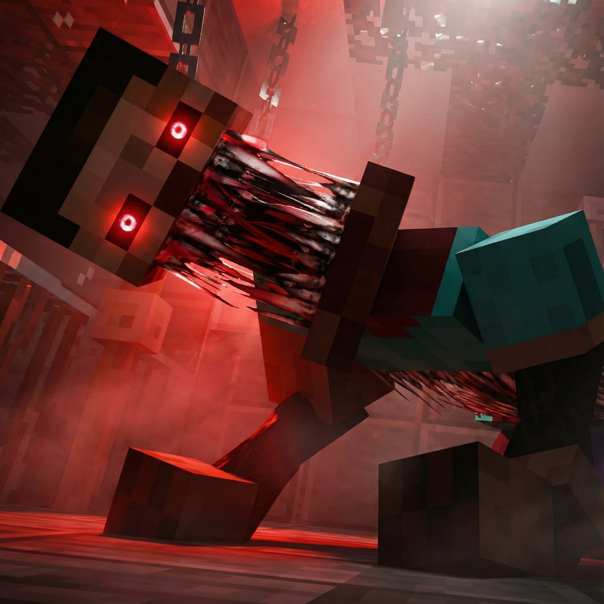

<div align="center">



# Still Watching

### A Forge 1.20.1 horror-survival modpack where the fog has teeth, the caves answer back, and the quiet is usually lying.

[](https://github.com/SoumyajitXD/Still-Watching/actions/workflows/ci.yml)
[](https://www.curseforge.com/minecraft/modpacks/still-watching/files)
[](https://www.curseforge.com/minecraft/modpacks/still-watching)
[](./LICENSE)

**[Install on CurseForge](https://www.curseforge.com/minecraft/modpacks/still-watching/files)** ·
**[Installation Guide](./installation-guide.md)** ·
**[Report a Bug](https://github.com/SoumyajitXD/Still-Watching/issues)** ·
**[Mod List](./latest-modlist.md)** ·
**[Screenshots](./Screenshots)** ·
**[CurseForge Gallery](https://www.curseforge.com/minecraft/modpacks/still-watching/gallery)**

</div>

---

> [!IMPORTANT]
> ## Install from CurseForge. Not the GitHub ZIP.
>
> The GitHub ZIP is **not** a playable modpack installer. It is source-side repository content for docs, issues, screenshots, release-side files, validation, and licensing clarity.
>
> Use the official CurseForge release. If GitHub and CurseForge disagree about a playable file, **trust CurseForge** and report the mismatch.

---

## Choose Your Door

| Role | Start here | Do not skip |
| --- | --- | --- |
| **Players** | [Install on CurseForge](https://www.curseforge.com/minecraft/modpacks/still-watching) | Allocate `5 GB` minimum RAM; `6–8 GB` preferred. |
| **Server admins** | [`installation-guide.md`](./installation-guide.md#multiplayer--server-setup) and [`server-pack-guide.md`](./docs/server-pack-guide.md) | Match versions/configs. Keep client-only junk off dedicated servers. |
| **Bug reporters** | [GitHub Issues](https://github.com/SoumyajitXD/Still-Watching/issues) | Test a clean CurseForge install and attach logs. Vibes are not diagnostics. |
| **Maintainers** | [`python .github/scripts/validate.py all`](#maintainer-checks) | Validate before release-side edits. Guesswork belongs in horror, not maintenance. |

---

## What Is Still Watching?

**Still Watching** is a Minecraft Java Edition **horror-survival modpack** by **Soumyajit** for **Minecraft 1.20.1** on **Forge**.

It keeps the familiar survival loop — mine, build, loot, travel, recover — then drags it through fog, darkness, hostile structures, audio pressure, and stalking horror. The goal is not random noise spam. The goal is dread with consequences.

You are still playing Minecraft. You are just no longer allowed to pretend the dark is decorative.

---

## Project at a Glance

| Item | Details |
| --- | --- |
| **Project name** | Still Watching |
| **Creator** | Soumyajit |
| **Type** | Minecraft Java Edition horror-survival modpack |
| **Current documented release** | Still Watching V1.1.0 |
| **Minecraft version** | `1.20.1` |
| **Loader** | Forge |
| **Java** | Java `17` if the launcher asks |
| **Official playable release** | [CurseForge](https://www.curseforge.com/minecraft/modpacks/still-watching) |
| **CurseForge Project ID** | `1420406` |
| **RAM** | `5 GB` minimum; `6–8 GB` preferred |
| **Repository license** | [Apache License 2.0](./LICENSE) for original repository files only |

---

## Quick Install

1. Install the [CurseForge App](https://www.curseforge.com/download/app).
2. Open [Still Watching on CurseForge](https://www.curseforge.com/minecraft/modpacks/still-watching).
3. Install the latest release.
4. Allocate **5 GB minimum RAM**; **6–8 GB preferred**.
5. Use **Java 17** if the launcher asks.
6. Launch once clean before adding extra mods, shaders, or resource packs.

Need manual import notes, server setup, backups, logs, or actual troubleshooting? Use [`installation-guide.md`](./installation-guide.md). The README is the front door, not the entire filing cabinet.

---

## Pack Focus

- Fog-heavy exploration where distance and visibility matter.
- Sound-led tension from ambience, footsteps, silence, and proximity cues.
- Stalking horror entities that make careless travel expensive.
- Caves, forests, roads, towns, ruins, and structures that are worth exploring but unsafe.
- Multiplayer paranoia where voice chat can turn one strange sound into a full team collapse.

This is not a kitchen-sink pack with horror mobs taped onto the side like cheap Halloween stickers. The pack has a job: make survival feel watched.

---

## Content Snapshot

Still Watching includes horror entities, worldgen, structures, ambience, visual pressure, sound mods, performance support, exploration tools, and quality-of-life utilities. For the complete repository list, use [`latest-modlist.md`](./latest-modlist.md).

| Category | Examples |
| --- | --- |
| **Horror** | The Anomaly, The Man From The Fog, From The Fog, The Mimicer, Apollyon, Siren Head, GoatMan, Cave Dweller Reimagined |
| **Atmosphere & sound** | AmbientSounds, Presence Footsteps, Sound Physics Remastered, EnhancedVisuals |
| **World & structures** | Biomes O' Plenty, Valhelsia Structures, Dungeons Enhanced, Towns and Towers, Explorify |
| **Multiplayer & utility** | Simple Voice Chat, FTB Teams, FTB Quests, JourneyMap, Corpse |
| **Performance & visuals** | Embeddium, Embeddium Extras, Oculus, Euphoria Patches |

---

## Multiplayer & Servers

Multiplayer is supported when every player and the server use matching pack versions, configs, and files.

Keep it boring:

- Same Still Watching version on server and clients.
- Same Minecraft version: `1.20.1`.
- Same required Forge version for the selected release.
- Matching configs and server files.
- No client-only visual, shader, UI, map, audio-only, or rendering mods on a dedicated server.
- Backups before updates or server moves.

For setup details, read [`installation-guide.md`](./installation-guide.md#multiplayer--server-setup). For conservative server-pack trimming notes, read [`docs/server-pack-guide.md`](./docs/server-pack-guide.md). Guessing at Forge server files is not bravery. It is just feeding the crash log.

<div align="center">

<!-- sponsor:bisecthosting:start -->
<a href="https://url-shortener.curseforge.com/AZDOs" rel="nofollow">
  
</a>
<!-- sponsor:bisecthosting:end -->

</div>

---

## Troubleshooting First Moves

| Problem | Start here |
| --- | --- |
| **Crash on launch** | Reinstall through CurseForge, remove extras, allocate `5 GB+`, use Java `17` if asked, then check logs. |
| **Missing mods** | Reinstall from CurseForge. The GitHub ZIP is not an installer. |
| **Low FPS** | Lower render distance, reduce shaders/visual settings, and check RAM allocation. |
| **Server/client mismatch** | Match the exact pack version, Forge version, configs, and files on server and clients. |
| **Bug after adding mods** | Reproduce on a clean CurseForge install before reporting. Extra mods are suspects, not innocent civilians. |

Full fixes: [`installation-guide.md`](./installation-guide.md#troubleshooting)

---

## Reporting Issues

Before opening an issue, test on a clean CurseForge install when possible.

Include the pack version, launcher, Minecraft version, Forge version if visible, Java version if relevant, operating system, singleplayer/multiplayer status, crash report or `latest.log`, reproduction steps, and any extra mods/shaders/resource packs/config edits.

Bad report:

```text
it broke fix pls
```

Good report:

```text
Pack version: Still Watching V1.1.0
Launcher: CurseForge App
Minecraft: 1.20.1
Mode: Singleplayer
Issue: Crash when entering a cave structure in a new world
Steps:
1. Install from CurseForge
2. Launch with no extra mods, shaders, or resource packs
3. Create a new world
4. Enter the structure
5. Game crashes
Attached: latest.log and crash report
```

Logs matter. Vibes are not diagnostics.

---

## Repository Map

| Path | Purpose |
| --- | --- |
| [`README.md`](./README.md) | Main GitHub landing page. |
| [`installation-guide.md`](./installation-guide.md) | Install, update, multiplayer, server, backup, and troubleshooting guide. |
| [`latest-modlist.md`](./latest-modlist.md) | Current repository mod list. |
| [`curseforge-description.html`](./curseforge-description.html) | CurseForge description source. |
| [`Screenshots/`](./Screenshots) | Screenshot assets. |
| [`Releases/`](./Releases) | Release-side files. |
| [`.github/ISSUE_TEMPLATE/`](./.github/ISSUE_TEMPLATE) | Issue templates. |
| [`.github/workflows/ci.yml`](./.github/workflows/ci.yml) | Repository validation workflow. |
| [`.github/scripts/validate.py`](./.github/scripts/validate.py) | Local validation script. |
| [`LICENSE`](./LICENSE) | Apache License 2.0 for original repository files. |

---

## Maintainer Checks

Before touching release-facing docs, run:

```bash
python .github/scripts/validate.py all
```

That check catches boring-but-expensive mistakes early: broken local Markdown links, missing referenced files, Repository Map drift, CurseForge ID mismatches, sponsor block damage, and release text drift. Ship dread, not sloppy Markdown shrapnel.

---

## Contributing, Support, and Security

- Contribution rules: [`CONTRIBUTING.md`](./CONTRIBUTING.md)
- Support boundaries: [`SUPPORT.md`](./SUPPORT.md)
- Security/reporting suspicious downloads: [`SECURITY.md`](./SECURITY.md)
- Changes by release: [`CHANGELOG.md`](./CHANGELOG.md)

Useful contributions are tested docs, reproducible reports, compatibility notes backed by evidence, and missing credit/attribution corrections. Not useful: random mod soup, crash complaints with no logs, or anything that weakens required sponsor content.

---

## Credits & License

**Still Watching** is created and published by **Soumyajit**.

Credit goes to the Minecraft modding community: mod authors, library maintainers, shader and resource creators, artists, sound designers, tool developers, and everyone whose work makes modded Minecraft possible.

Original files in this repository are licensed under the **Apache License 2.0**. See [`LICENSE`](./LICENSE). Third-party mods, shaders, resource packs, sounds, textures, libraries, tools, and external assets remain under their own licenses, permissions, and distribution terms.

Support the original authors. Modding only works when people get credited for the work they actually did.

---

<div align="center">

**Install through CurseForge. Back up your world. Put on headphones. Do not trust the quiet.**

[Install Still Watching](https://www.curseforge.com/minecraft/modpacks/still-watching/files)

</div>
